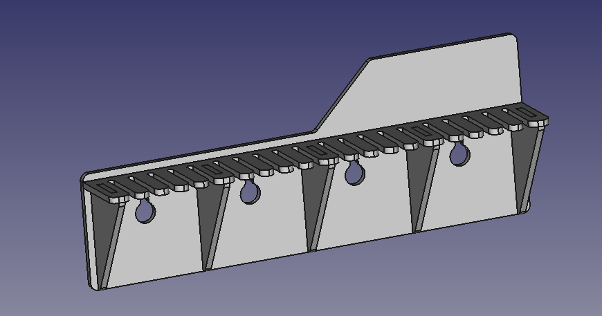

# parametric-laser-cut-cable-holder
This cable holder is completly parametric, you can change following parameters with easy:
## Parameters
### Cable Slots
- Number of cable slots
- Cable slot depth
- Cable slot width

### Supports
- Number of supports
- Support height

### Mounting hole
- Screw head diameter
- Screw diameter

### Label (right top)
- width
- height

